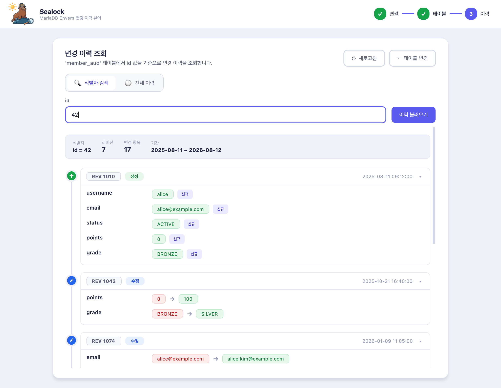
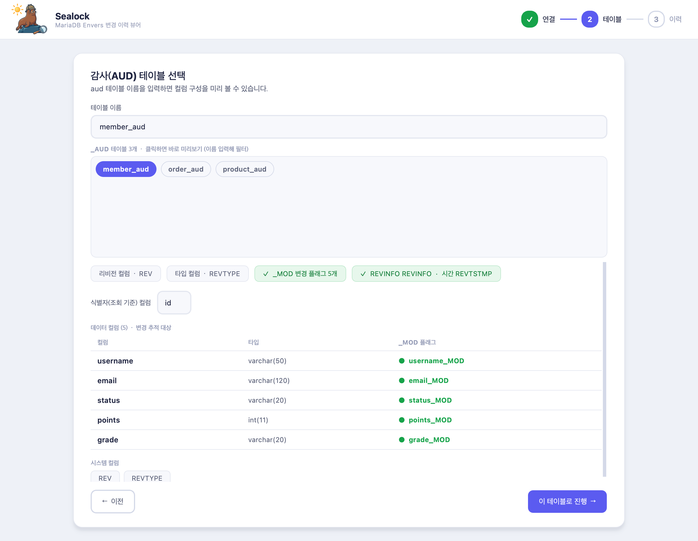
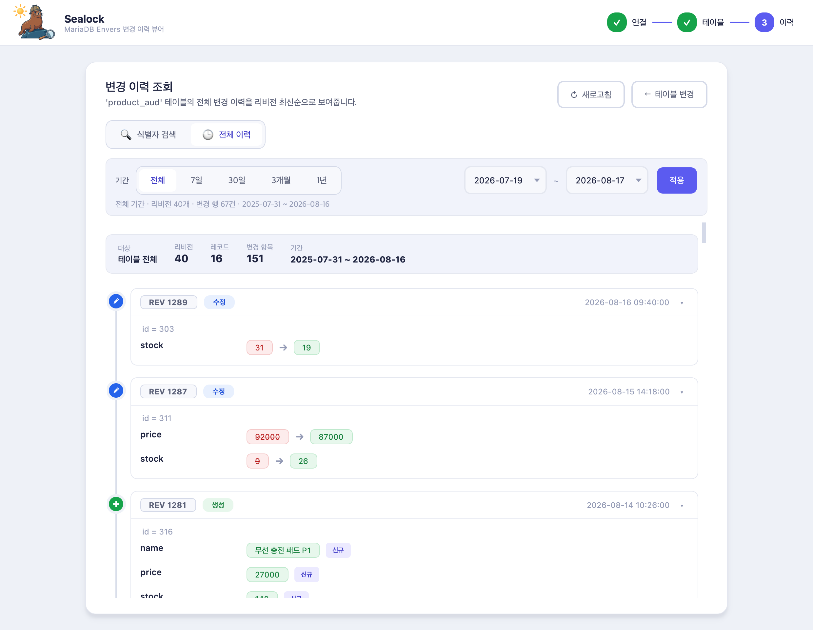
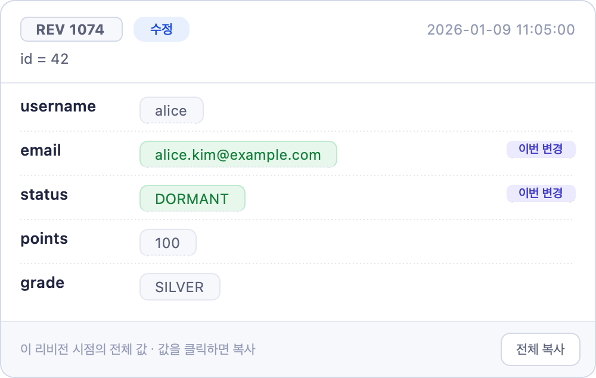
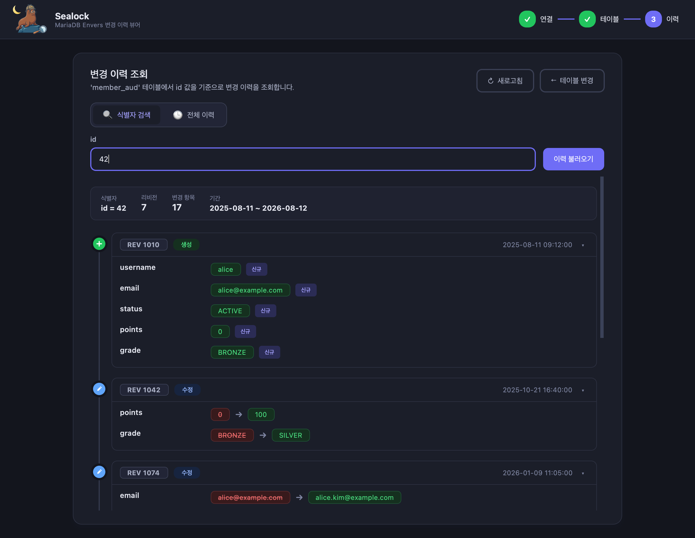

<p align="center">
  
</p>

<h1 align="center">Sealock</h1>

<p align="center">
  MariaDB <b>Hibernate Envers</b> 감사 테이블(<code>*_AUD</code>)을 열어<br>
  <b>무엇이 무엇으로 바뀌었는지</b> 타임라인으로 보여주는 데스크톱 앱
</p>

<p align="center">
  <a href="https://github.com/Hyuntae-Jeong/Sealock/releases/latest"></a>
  
  <a href="LICENSE"></a>
</p>

<p align="center"><i>A desktop viewer that turns MariaDB Hibernate&nbsp;Envers audit tables into a readable before&nbsp;→&nbsp;after timeline.</i></p>

<p align="center">
  
</p>

## 왜 필요한가

Envers 감사 테이블은 **변경 후 값만** 저장하고, 어떤 컬럼이 바뀌었는지는 `<컬럼>_MOD = 1` 플래그로만 남깁니다. 그래서 원본 행을 그대로 읽으면 "바뀌었다"는 사실까지만 알 수 있습니다.

```sql
SELECT * FROM member_aud WHERE id = 42 AND REV = 1042;
```

```
REV   REVTYPE  id  username  email              status  points  grade   points_MOD  grade_MOD  ...
1042  1        42  alice     alice@example.com  ACTIVE  100     SILVER  1           1          ...
```

`points` 와 `grade` 가 바뀐 건 알겠는데, **무엇에서** 바뀌었는지는 없습니다. 알아내려면 같은 `id` 의 이전 리비전 행을 직접 찾아 눈으로 맞춰봐야 합니다. 리비전이 쌓일수록 이 비교는 감당하기 어려워집니다.

Sealock는 그 비교를 대신합니다.

```
REV 1042 · 수정 · 2025-10-21 16:40
  points   0       →  100
  grade    BRONZE  →  SILVER
```

## 다운로드

**[최신 릴리즈 받기 →](https://github.com/Hyuntae-Jeong/Sealock/releases/latest)**

| 플랫폼 | 파일 | 비고 |
|---|---|---|
| Windows | `Sealock-Windows.zip` | 단일 `.exe`, 설치 불필요 |
| macOS | `Sealock-macOS.zip` | `.app` 번들, Apple Silicon(arm64) |

> macOS 앱은 코드 서명이 되어 있지 않습니다. 첫 실행은 **우클릭 → 열기** 로 열어주세요.

DB에 연결하지 않고도 첫 화면의 **"샘플 데이터로 둘러보기"** 로 전체 흐름을 그대로 체험할 수 있습니다. 아래 스크린샷도 전부 그 샘플 데이터입니다.

## 동작 방식

<table>
<tr>
<td width="50%"></td>
<td width="50%"></td>
</tr>
<tr>
<td><b>① 연결 → ② 테이블</b><br>접속 정보를 넣고 연결을 테스트하면 스키마의 <code>*_AUD</code> 테이블을 찾아 보여줍니다. 하나를 고르면 컬럼을 <b>데이터 / <code>_MOD</code> 플래그 / 시스템</b> 으로 갈라 미리 보여주고, <code>REVINFO</code> 도 함께 찾아 리비전 시각을 붙일 수 있는지 알려줍니다.</td>
<td><b>③ 이력</b><br><b>식별자 검색</b> 은 ID 하나의 변경 이력을 처음부터 끝까지 따라갑니다. <b>전체 이력</b> 은 테이블 전체를 리비전 최신순으로 보여주되, 먼저 조회량을 집계해 보여주고 기간(전체 · 7일 · 30일 · 3개월 · 1년 · 직접 선택)을 고른 뒤 <b>적용</b> 할 때 불러옵니다.</td>
</tr>
</table>

## 기능

- **이전 → 이후 diff** — 생성 · 수정 · 삭제를 구분하고, 바뀐 컬럼만 옛 값에 취소선을 그어 나란히 보여줍니다.
- **그 시점의 전체 값** — 리비전 카드를 **우클릭** 하면 바뀐 컬럼뿐 아니라 그 리비전 시점의 모든 필드 값을 팝업으로 봅니다. 값을 클릭하면 복사, `전체 복사` 는 JSON으로 복사합니다.
- **기간 필터와 페이징** — 리비전이 많으면 첫 페이지만 불러오고 **이전 리비전 더 보기** 로 같은 기간 안에서 이어 붙입니다.
- **키보드 이동** — `↑` `↓` 로 카드 사이를 옮겨 다니고 `←` `→` 로 접고 펼칩니다.
- **라이트 / 다크 테마** — 왼쪽 위 **바다사자 아이콘을 클릭**하면 전환됩니다. 고른 테마는 다음 실행에도 유지됩니다.
- **앱 안에서 업데이트** — **설정**에서 새 버전을 확인하고 앱을 벗어나지 않고 바로 설치합니다. 변경 내역은 [CHANGELOG.md](CHANGELOG.md) 에 있고, 같은 글을 **릴리즈 노트 보기** 로 앱 안에서도 볼 수 있습니다.

<table>
<tr>
<td width="50%" valign="top"></td>
<td width="50%" valign="top"></td>
</tr>
<tr>
<td align="center"><b>우클릭 — 그 리비전 시점의 전체 값</b></td>
<td align="center"><b>다크 테마</b></td>
</tr>
</table>

### 접속 정보는 어떻게 다루나

입력한 접속 정보는 **실행 중 메모리에만** 있고 디스크에 저장되지 않습니다. 앱이 DB에 보내는 것은 스키마를 살펴보고 감사 행을 읽는 **조회 쿼리뿐**입니다. 저장되는 설정은 마지막에 고른 테마 하나입니다.

업데이트도 **직접 누를 때만** 확인합니다 — 시작할 때 몰래 찔러보거나 백그라운드로 도는 타이머는 없습니다. 앱이 DB 밖으로 나가는 통신은 그때 GitHub 릴리즈를 확인하고, 설치를 고르면 그 파일을 내려받는 것뿐입니다.

## 이름에 대하여

<p align="center">
  <b>Sea</b> lion &nbsp;+&nbsp; Sher<b>lock</b> &nbsp;=&nbsp; <b>Sealock</b>
</p>

이름 하나에 세 가지 뜻이 겹쳐 있습니다.

- 🦭 **Sea lion** — 바다사자는 **MariaDB의 공식 마스코트 동물**입니다(MySQL의 돌고래처럼요). MariaDB 전용 도구라는 정체성을 그대로 담았고, 이 앱의 마스코트·아이콘이기도 합니다.
- 🔍 **Sher*lock*** — 흩어진 감사 로그를 단서 삼아 "무엇이 무엇으로 바뀌었는지" 파고드는 탐정처럼.
- 📜 **실록(實錄)** — 게다가 한국어로는 *실록*, 사건을 시간순으로 남긴 연대기. 이 도구가 보여주는 **변경 타임라인** 그 자체입니다.

## 소스에서 실행

Python 3.13 · Windows · macOS

```bash
python app.py
```

Windows 에서는 `run.vbs` 를 더블클릭하면 `.venv` 를 만들고 의존성을 설치한 뒤 앱을 띄웁니다(설치 로그를 보려면 `run.bat`). 앱 패키징은 Windows 는 `build.bat` 으로 단일 `.exe` 를, macOS 는 `./build.sh` 로 `.app` 번들을 만듭니다.

개발 중 로그인 폼을 자동으로 채우려면 `config.example.json` 을 `config.local.json` 으로 복사해 값을 채우세요. 이 파일은 `.gitignore` 에 포함되어 커밋되지 않습니다.

빌드 · 릴리즈 · 기여 규칙은 [CONTRIBUTING.md](CONTRIBUTING.md) 를 참고하세요.

## 기술 스택

- **UI** — PySide6 (Qt), 라이트/다크 두 테마와 QSS 스타일, 커스텀 타임라인 위젯
- **DB** — PyMySQL (순수 파이썬), 읽기 전용 조회
- **패키징** — PyInstaller (Windows 단일 `.exe` / macOS `.app`), GitHub Actions 로 태그 푸시 시 자동 빌드

## 라이선스

[MIT](LICENSE) © 2026 Hyuntae Jeong
